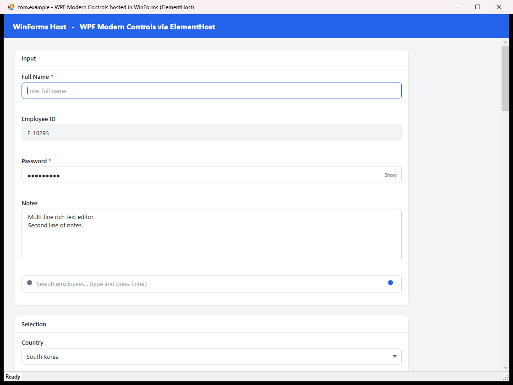
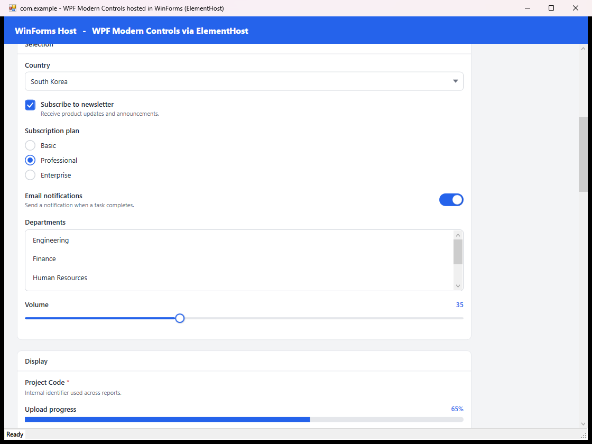
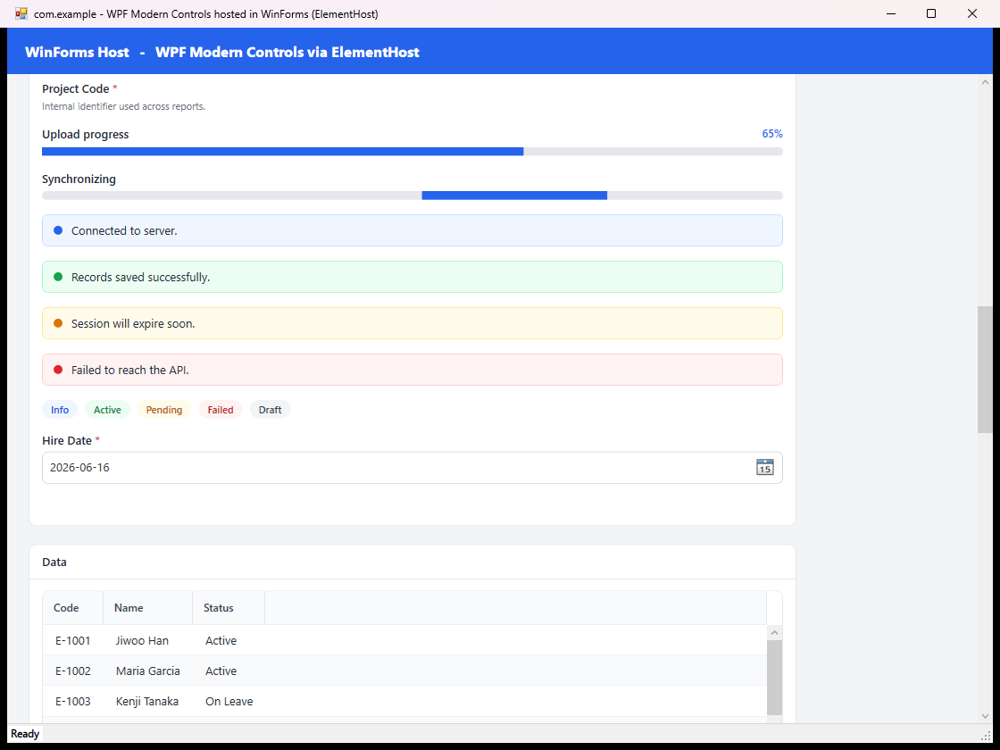
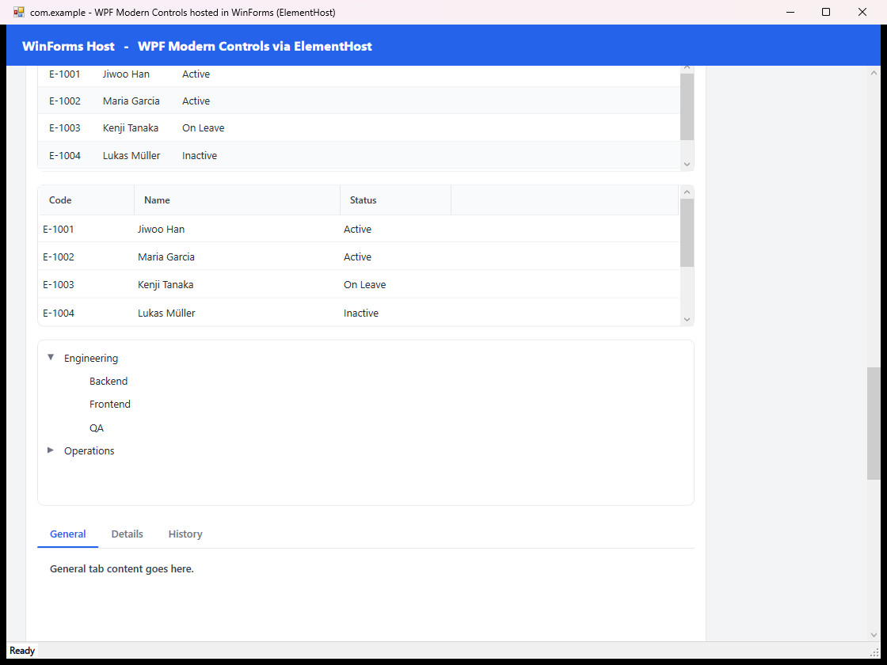
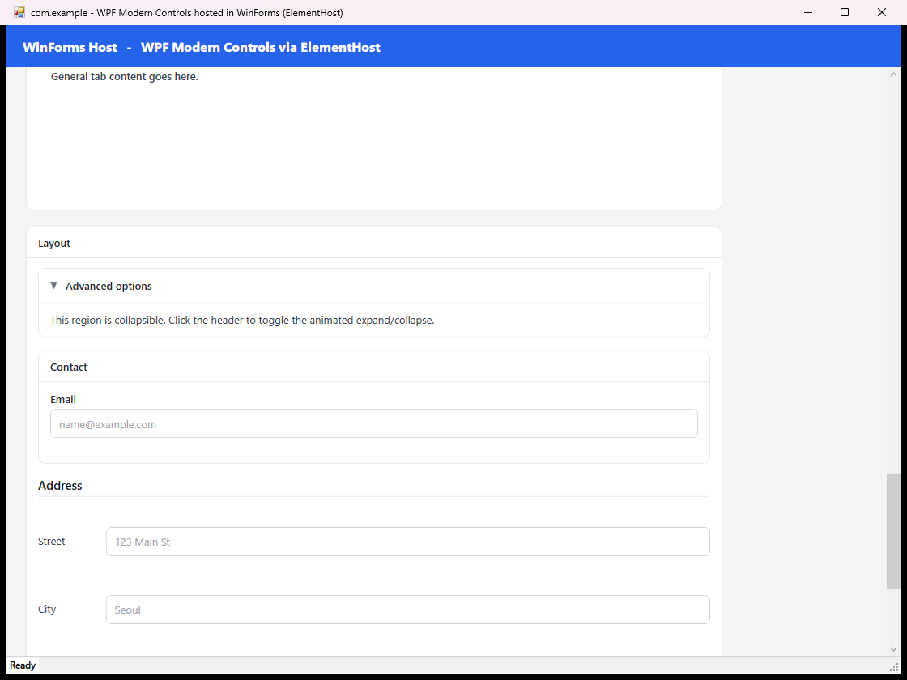

# com.example — Modern WPF Control Library

A set of **23 pure-WPF UserControls** with a clean, conservative, enterprise look,
built for **.NET Framework 4.8** and designed to be hosted inside existing
**WinForms** applications through `ElementHost`.

- **No third-party UI frameworks** — no MahApps, ModernWpf, MaterialDesign, DevExpress, Telerik, or Syncfusion. Pure WPF only.
- **Bindable by design** — every reusable value is exposed as a `DependencyProperty`.
- **WinForms-first hosting** — each control drops into a `System.Windows.Forms.Integration.ElementHost`.
- **Incremental modernization** — add modern UI to legacy WinForms forms without rewriting business logic.

> Namespace root: `com.example` · IDE: Visual Studio 2026 · Language: C#

---

## Screenshots

The included **WinForms demo host** (`com.example.Demo`) renders every control inside a single
`ElementHost`, framed by a native WinForms header and status bar.

### Input


Labeled text box (required / placeholder / focus states), read-only text box, password box with show/hide toggle, multi-line rich text, and a search box.

### Selection


Styled combo box, checkbox, radio button group, animated toggle switch, list box, and slider.

### Display


Label, determinate & indeterminate progress bars, color-coded status bars (Info / Success / Warning / Error), pill badges, and a date picker.

### Data


DataGrid with alternating rows, GridView-based ListView, hierarchical TreeView with expand/collapse arrows, and an underline-style TabControl.

### Layout


Animated Expander, GroupBox, FormSection (shared-size aligned label/input rows), and a ScrollSection with a fixed header.

---

## Controls

| Group | Controls |
|-------|----------|
| **Input** | `ModernTextBoxControl`, `ModernPasswordBoxControl`, `ModernRichTextBoxControl`, `ModernSearchBoxControl` |
| **Selection** | `ModernComboBoxControl`, `ModernCheckBoxControl`, `ModernRadioButtonGroupControl`, `ModernToggleSwitchControl`, `ModernListBoxControl`, `ModernSliderControl` |
| **Display** | `ModernLabelControl`, `ModernProgressBarControl`, `ModernStatusBarControl`, `ModernBadgeControl`, `ModernDatePickerControl` |
| **Data** | `ModernDataGridControl`, `ModernListViewControl`, `ModernTreeViewControl`, `ModernTabControl` |
| **Layout** | `ModernExpanderControl`, `ModernGroupBoxControl`, `ModernFormSectionControl`, `ModernScrollSectionControl` |

The full DependencyProperty / public-API surface for each control is documented in
[`INTEGRATION.md`](INTEGRATION.md).

---

## Solution layout

```
wpfControls
├── com.example.sln
├── com.example.csproj            # WPF class library (the controls)
├── INTEGRATION.md                # hosting guide + API reference
├── Properties/AssemblyInfo.cs
├── Models/Ui/                    # ComboBoxItemModel, RadioButtonItemModel, TreeViewItemModel
├── Controls/Wpf/
│   ├── Input/   Selection/   Display/   Data/   Layout/
└── Demo/
    ├── com.example.Demo.csproj   # WinForms host executable
    ├── Program.cs                # [STAThread] entry point
    ├── DemoForm.cs               # native WinForms shell + ElementHost
    ├── GalleryBuilder.cs         # builds the WPF gallery (all 23 controls)
    └── DemoRow.cs                # sample data model
```

---

## Build & run

**Requirements:** Visual Studio 2026 (or MSBuild) with the .NET Framework 4.8 targeting pack.

```powershell
# Build the whole solution
msbuild com.example.sln /t:Rebuild /p:Configuration=Debug

# Run the WinForms demo host
.\Demo\bin\Debug\com.example.Demo.exe
```

In Visual Studio: set **com.example.Demo** as the startup project and press **F5**.
Type in the demo's search box and press **Enter** to see a WPF routed event update the
native WinForms status bar.

---

## Hosting a control in WinForms

```csharp
using System.Windows.Forms;
using System.Windows.Forms.Integration;
using com.example.Controls.Wpf.Input;

ModernTextBoxControl textBox = new ModernTextBoxControl();
textBox.Title = "Customer Name";
textBox.PlaceholderText = "Enter full name";
textBox.IsRequired = true;

ElementHost host = new ElementHost();
host.Dock = DockStyle.Top;
host.Height = 80;
host.Child = textBox;

this.Controls.Add(host);   // 'this' is your existing WinForms Form
```

The host project must reference `WindowsFormsIntegration`, `PresentationCore`,
`PresentationFramework`, `WindowsBase`, and the `com.example` library. See
[`INTEGRATION.md`](INTEGRATION.md) for ComboBox, SearchBox event, and layout examples,
plus common build/integration failure points.

---

## Conventions

- Explicit types everywhere (no `var`); explicit access modifiers; braces on all control blocks.
- XAML `x:Class`, code-behind namespace, and folder structure always match.
- Each `.xaml` builds as `Page`; each code-behind is a `partial` class.
