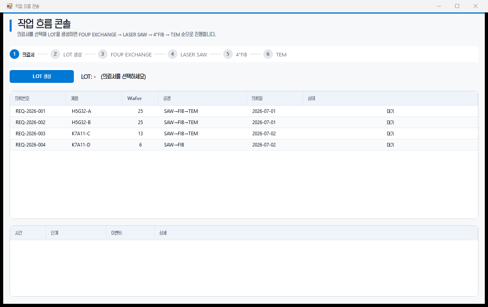
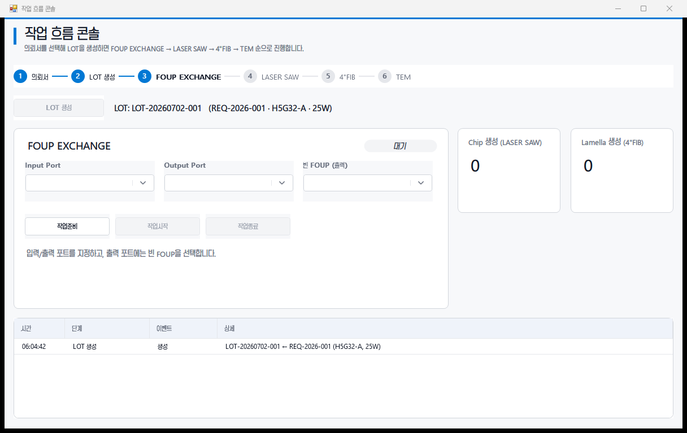
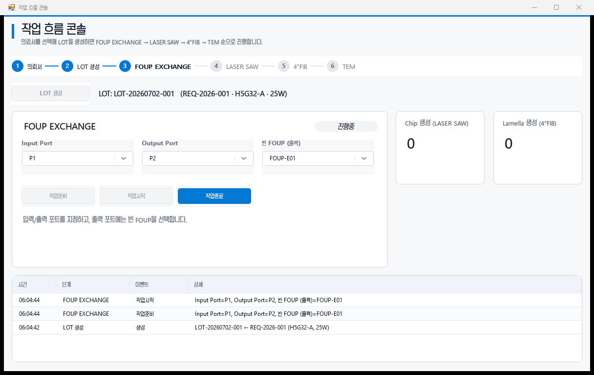
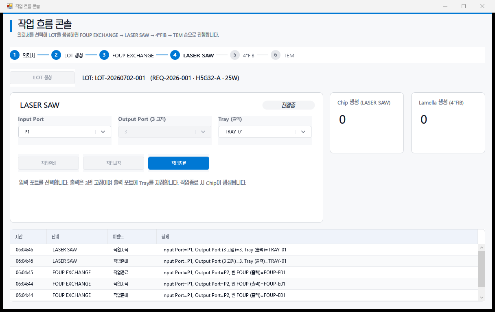
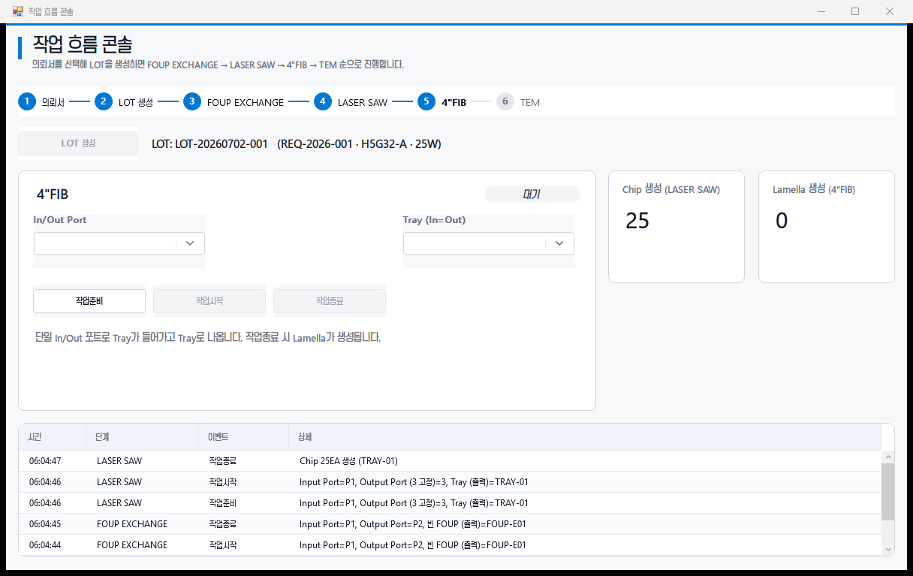
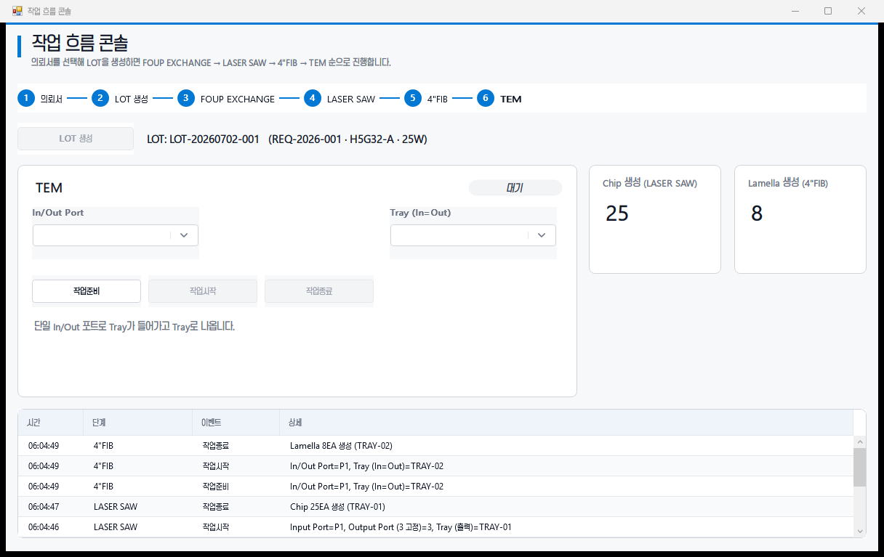
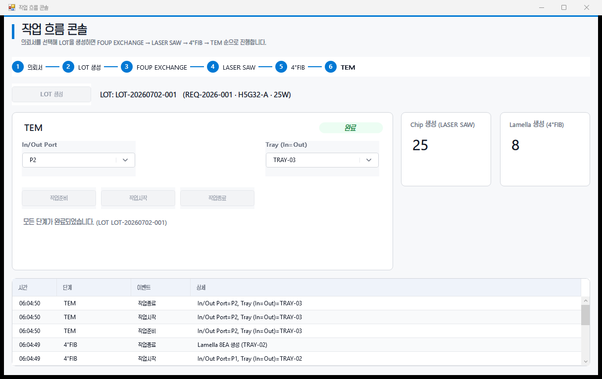

# 작업 흐름 콘솔 (Process Flow Console)

의뢰서에서 시작해 하나의 LOT을 **FOUP EXCHANGE → LASER SAW → 4″FIB → TEM** 라인으로 진행하는 시작점 화면입니다.
LOT 생성 이후 각 단계는 **작업준비 · 작업시작 · 작업종료**를 가지며, 단계별 규칙은 다음과 같습니다.

| 단계 | 작업준비 입력 | 작업종료 결과 |
|---|---|---|
| FOUP EXCHANGE | Input / Output Port, 출력 포트에 **빈 FOUP** | — |
| LASER SAW | Input Port, **Output 3번 고정**, 출력 포트에 **Tray** | **Chip 생성** |
| 4″FIB | **단일 In/Out 포트**, Tray in·out | **Lamella 생성** |
| TEM | 단일 In/Out 포트, Tray in·out | — |

> UI 셸(예제 데이터)이며, 전부 공통 컨트롤(`ModernStepIndicator`, `ModernComboBox`, `ModernButton`, `ModernDataGrid`, `CardPanel`, `StatBadge`)로 구성했습니다.
> 스크린샷은 `com.example.samples.exe --shots <dir>` 하니스로 단계별 자동 캡처한 것입니다.

## 단계별 화면

### 1. 의뢰서 목록 (시작)
의뢰서 목록에서 LOT 정보(제품·Wafer 수·공정)를 확인하고 선택합니다.

### 2. LOT 생성 → FOUP EXCHANGE
선택한 의뢰서로 LOT을 생성하면 FOUP EXCHANGE 단계가 시작됩니다. 출력 포트에는 빈 FOUP을 지정합니다.

### 3. FOUP EXCHANGE 진행중
작업준비 → 작업시작으로 상태가 전이됩니다.

### 4. LASER SAW
입력 포트를 선택하고, 출력은 3번 고정 · 출력 포트에 Tray를 지정합니다.

### 5. Chip 생성 → 4″FIB
LASER SAW 작업종료 시 Chip이 생성되고 4″FIB 단계로 넘어갑니다.

### 6. Lamella 생성 → TEM
4″FIB 작업종료 시 Lamella가 생성되고 TEM 단계로 넘어갑니다.

### 7. 전체 완료
TEM 작업종료로 전 공정이 완료됩니다. (Chip / Lamella 누적, 이벤트 로그)

